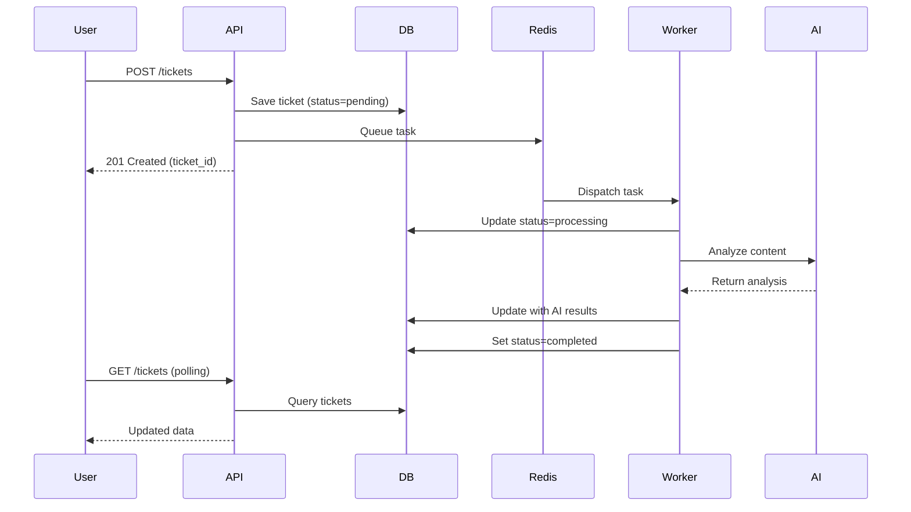

# AI Support Hub 🎯

A production-ready MVP demonstrating modern full-stack architecture with asynchronous ticket processing, LLM-based triage, and real-time UI updates.

## 🚀 Architecture Overview

This system showcases **non-blocking API design** with background task processing:

1. **User submits ticket** → API responds instantly (< 100ms)
2. **Celery worker processes in background** → Analyzes with AI
3. **Frontend polls for updates** → Shows real-time status changes

### Technology Stack

- **Backend:** FastAPI (Async Python)
- **Database:** PostgreSQL 16 (with SQLAlchemy ORM)
- **Queue/Broker:** Redis 7
- **Worker:** Celery (Background task processing)
- **Frontend:** Next.js 14+ (App Router, TypeScript, Tailwind CSS)
- **Infrastructure:** Docker Compose

## 📁 Project Structure

```
ai-support-hub/
├── backend/
│   ├── app/
│   │   ├── main.py          # FastAPI entry point & routes
│   │   ├── database.py      # Async SQLAlchemy setup
│   │   ├── models.py        # Database ORM models
│   │   ├── schemas.py       # Pydantic validation schemas
│   │   ├── tasks.py         # Celery worker tasks
│   │   └── config.py        # Settings management
│   ├── alembic/             # Database migrations
│   ├── Dockerfile
│   └── pyproject.toml
├── frontend/
│   ├── app/                 # Next.js App Router
│   ├── components/          # React components
│   ├── lib/                 # Utilities & types
│   ├── Dockerfile
│   └── package.json
├── docker-compose.yml       # Multi-service orchestration
├── .env.example             # Environment template
└── README.md
```

## 🏗️ Database Schema

**Tickets Table:**
```sql
CREATE TABLE tickets (
    id UUID PRIMARY KEY,
    request_content TEXT NOT NULL,
    status VARCHAR(20) NOT NULL,  -- pending | processing | completed | failed
    urgency VARCHAR(10),           -- High | Medium | Low (AI-filled)
    sentiment_score INTEGER,       -- 1-10 scale (AI-filled)
    category VARCHAR(50),          -- Billing | Technical | Feature (AI-filled)
    draft_response TEXT,           -- AI-generated response
    created_at TIMESTAMP DEFAULT NOW()
);
```

## 🔧 Setup Instructions

### Prerequisites

- Docker Desktop (or Rancher Desktop)
- Git

### Quick Start

1. **Clone the repository**
   ```bash
   git clone <repo-url>
   cd Ticket-Management-System
   ```

2. **Create environment file**
   ```bash
   cp .env.example .env
   # Edit .env if needed (defaults work for local development)
   ```

3. **Start all services**
   ```bash
   docker-compose up --build
   ```

4. **Access the application**
   - Frontend: http://localhost:3000
   - Backend API: http://localhost:8000
   - API Docs: http://localhost:8000/docs

### First Time Setup

The system automatically:
- Creates the database schema on first run
- Applies migrations via Alembic
- Seeds initial data (if configured)

## 📡 API Endpoints

### `POST /api/tickets`
Submit a new support ticket (non-blocking).

**Request:**
```json
{
  "request_content": "My account is locked and I can't log in"
}
```

**Response (Immediate):**
```json
{
  "id": "123e4567-e89b-12d3-a456-426614174000",
  "status": "pending",
  "created_at": "2026-02-02T18:42:00Z"
}
```

### `GET /api/tickets`
List all tickets with optional filters.

**Query Parameters:**
- `status`: Filter by status (pending, processing, completed, failed)
- `category`: Filter by category
- `limit`: Results per page (default: 50)
- `offset`: Pagination offset

### `GET /api/tickets/{id}`
Get details of a specific ticket.

## 🧠 AI Processing Flow



## 🔄 Development Workflow

### Viewing Logs

```bash
# All services
docker-compose logs -f

# Specific service
docker-compose logs -f backend
docker-compose logs -f worker
docker-compose logs -f frontend
```

### Database Access

```bash
# Connect to PostgreSQL
docker-compose exec db psql -U postgres -d tickets

# Run migrations
docker-compose exec backend alembic upgrade head
```

### Stopping Services

```bash
# Stop all
docker-compose down

# Stop and remove volumes (clean slate)
docker-compose down -v
```

## 🧪 Testing

### Manual End-to-End Test

1. **Submit a ticket via API:**
   ```bash
   curl -X POST http://localhost:8000/api/tickets \
     -H "Content-Type: application/json" \
     -d '{"request_content": "Billing issue with my subscription"}'
   ```

2. **Watch the logs:**
   ```bash
   docker-compose logs -f worker
   ```

3. **Check the result:**
   ```bash
   curl http://localhost:8000/api/tickets
   ```

### Frontend Testing

1. Navigate to http://localhost:3000
2. Submit a ticket via the form
3. Watch the dashboard auto-update (polling every 3 seconds)
4. Status should change: `pending` → `processing` → `completed`

## 🚦 Health Checks

All services include health checks:

```bash
# Backend API
curl http://localhost:8000/health

# Database
docker-compose exec db pg_isready

# Redis
docker-compose exec redis redis-cli ping
```

## 🎯 Key Features Demonstrated

✅ **Async/Non-blocking Architecture** - API never waits for slow operations  
✅ **Microservices Pattern** - Separate concerns (API, Worker, DB, Queue)  
✅ **Type Safety** - Pydantic in Python, TypeScript in frontend  
✅ **Real-time Updates** - SWR polling for live status changes  
✅ **Error Handling** - Graceful degradation with retry logic  
✅ **Containerization** - Everything runs in Docker  
✅ **Production-Ready** - Health checks, logging, migrations  

## 🔮 Future Enhancements

- Replace mock AI with real OpenAI integration
- Add WebSocket support for instant updates (instead of polling)
- Implement user authentication with JWT
- Add rate limiting and API throttling
- Deploy to Kubernetes
- Add Prometheus metrics and Grafana dashboards
- Implement ticket assignment to support agents

## 📚 Tech Stack Details

### Why FastAPI?
- Native async support for high concurrency
- Automatic OpenAPI documentation
- Built-in validation with Pydantic
- Excellent performance benchmarks

### Why Celery?
- **Decouples slow operations** from API response times
- **Scalable** - Add more workers as load increases
- **Reliable** - Tasks persist in Redis, retry on failure
- **Monitorable** - Built-in tools like Flower

### Why Next.js App Router?
- Server components for better performance
- Built-in routing and API routes
- TypeScript + Tailwind for DX
- Production-ready with SEO support

## 📝 License

MIT

## 🤝 Contributing

This is an MVP/assessment project. For production use, consider:
- Adding comprehensive test coverage
- Implementing proper authentication
- Setting up CI/CD pipelines
- Configuring production database backups
- Adding monitoring and alerting

---

**Built with ❤️ as a technical assessment demonstration**
