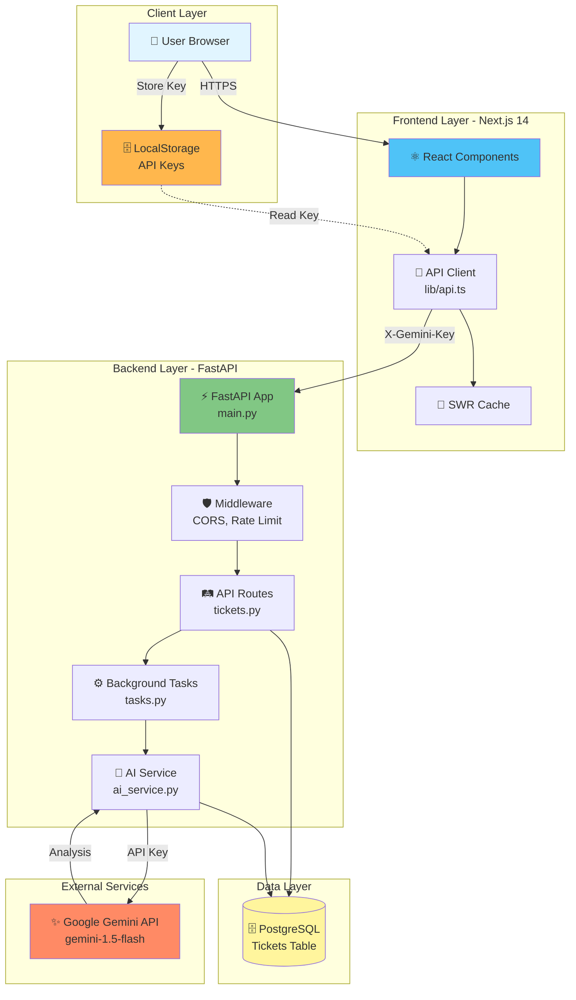
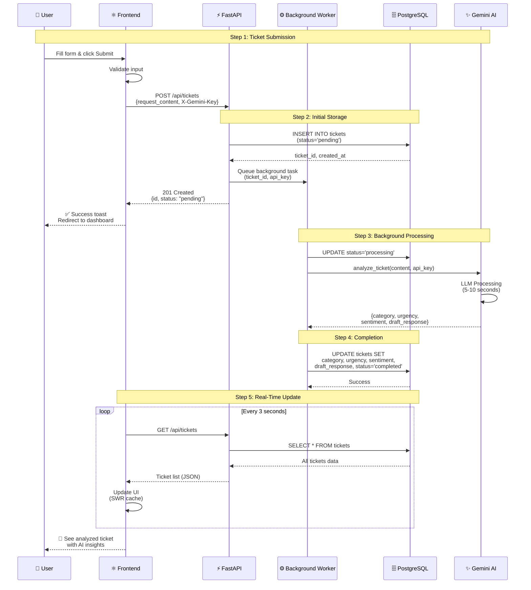

# AI Support Hub 🎯

> A production-ready, full-stack ticket management system with AI-powered automatic triage using FastAPI, Next.js 14, PostgreSQL, and Google Gemini AI.

[](https://fastapi.tiangolo.com/)
[](https://nextjs.org/)
[](https://www.postgresql.org/)
[](https://www.docker.com/)
[](https://www.typescriptlang.org/)
[](https://www.python.org/)

---

## 📑 Table of Contents

- [What is AI Support Hub?](#what-is-ai-support-hub)
- [Key Features](#key-features)
- [Live Demo URLs](#live-demo-urls)
- [How It Works](#how-it-works)
- [Architecture Deep Dive](#architecture-deep-dive)
- [Technology Stack](#technology-stack)
- [Project Structure](#project-structure)
- [Getting Started](#getting-started)
  - [Prerequisites](#prerequisites)
  - [Installation](#installation)
  - [First Run](#first-run)
  - [Configuration](#configuration)
- [Step-by-Step User Guide](#step-by-step-user-guide)
  - [1. Configuring Your API Key](#1-configuring-your-api-key)
  - [2. Submitting Your First Ticket](#2-submitting-your-first-ticket)
  - [3. Monitoring the Dashboard](#3-monitoring-the-dashboard)
  - [4. Database Management](#4-database-management)
- [API Reference](#api-reference)
- [Frontend Guide](#frontend-guide)
- [Backend Architecture](#backend-architecture)
- [Development](#development)
- [Testing](#testing)
- [Deployment](#deployment)
- [Troubleshooting](#troubleshooting)
- [FAQ](#faq)
- [Contributing](#contributing)
- [License](#license)

---

## What is AI Support Hub?

**AI Support Hub** is a modern, intelligent customer support ticket management system that automatically **categorizes**, **prioritizes**, and **generates draft responses** for incoming support requests using Google's Gemini AI.

### The Problem It Solves

Traditional support systems require manual ticket triage:
- ❌ Support agents spend hours sorting tickets
- ❌ Urgent issues get buried in the queue
- ❌ Response times are slow and inconsistent
- ❌ Customer sentiment is often missed

### Our Solution

AI Support Hub automatically:
- ✅ **Categorizes** tickets (Billing, Technical, Feature Request, Other)
- ✅ **Prioritizes** by urgency (High, Medium, Low)
- ✅ **Analyzes** customer sentiment (0-10 score)
- ✅ **Generates** professional draft responses in markdown
- ✅ **Processes** tickets in real-time via background tasks
- ✅ **Updates** dashboard automatically with live status

---

## Key Features

### 🤖 AI-Powered Triage

- **Google Gemini Integration** - Uses Gemini 1.5 Flash for fast, accurate analysis
- **BYOK (Bring Your Own Key)** - Users can provide their own Gemini API keys
- **Intelligent Fallback** - Degrades gracefully to heuristic analysis if AI unavailable
- **Context-Aware** - Understands ticket content and generates relevant responses

### 📊 Real-Time Dashboard

- **Live Updates** - SWR polling every 3 seconds
- **Ticket Status Tracking** - Pending → Processing → Completed
- **Filtering** - By status, category, urgency
- **Statistics** - Total tickets, completion rates, database metrics

### 🗄️ Database Management

- **Export Data** - CSV and JSON formats with pagination support
- **Bulk Operations** - Delete all tickets, clear database
- **Statistics** - Database size, active connections, ticket breakdown
- **Admin Panel** - Secure database operations

### 🔒 Security & Privacy

- **Client-Side Keys** - API keys stored in browser localStorage only
- **HTTPS Headers** - Keys transmitted via `X-Gemini-Key` header
- **No Server Storage** - User keys never saved to database
- **Rate Limiting** - Prevents API abuse
- **CORS Configured** - Cross-origin protection

### 🚀 Production Ready

- **Docker Compose** - One-command deployment
- **Health Checks** - Monitoring endpoints for all services
- **Error Handling** - Comprehensive error management
- **Logging** - Structured logging throughout
- **Type Safety** - TypeScript frontend, Pydantic backend

---

## Live Demo URLs

Once running locally:

| Service | URL | Description |
|---------|-----|-------------|
| **Frontend** | http://localhost:3000 | Main web interface |
| **Landing Page** | http://localhost:3000 | Marketing page with features |
| **Submit Ticket** | http://localhost:3000/submit | Ticket submission form |
| **Dashboard** | http://localhost:3000/dashboard | Admin dashboard (real-time) |
| **Settings** | http://localhost:3000/settings | API key configuration |
| **API Docs** | http://localhost:8000/docs | Interactive Swagger UI |
| **Health Check** | http://localhost:8000/health | Backend health status |
| **Database Stats** | http://localhost:8000/api/db/stats | Database metrics (JSON) |

---

## How It Works

### The Complete Ticket Lifecycle

```
┌─────────────────────────────────────────────────────────────┐
│                    User Journey                             │
└─────────────────────────────────────────────────────────────┘

1. User visits landing page
        ↓
2. Clicks "Submit Ticket" or navigates to /submit
        ↓
3. Enters support request (e.g., "My account is locked")
        ↓
4. Clicks "Submit Ticket"
        ↓
5. Frontend sends POST /api/tickets
        ↓
6. Backend creates ticket with status="pending"
        ↓
7. Returns ticket ID to frontend (201 Created)
        ↓
8. Frontend shows success toast, redirects to dashboard
        ↓
9. Background worker picks up ticket
        ↓
10. Status changes to "processing"
        ↓
11. AI analyzes ticket content
        ↓
12. Sets: category, urgency, sentiment, draft_response
        ↓
13. Status changes to "completed"
        ↓
14. Dashboard updates automatically (SWR polling)
        ↓
15. User sees analyzed ticket with AI insights
```

### Real-Time Updates Flow

```
Frontend Dashboard (SWR)
        ↓ (GET /api/tickets every 3s)
Backend API
        ↓ (SELECT * FROM tickets)
PostgreSQL Database
        ↑ (Real-time data)
Background Worker (tasks.py)
        ↑ (UPDATE tickets SET ...)
```

---

## Architecture Deep Dive

### System Architecture



### Request Flow - Creating a Ticket



### Data Flow

```
1. User Input
   ↓
2. Frontend Validation
   ↓
3. API Client (adds X-Gemini-Key header)
   ↓
4. FastAPI Endpoint
   ↓
5. Pydantic Validation
   ↓
6. Database Insert (pending)
   ↓
7. Background Task Queue
   ↓
8. AI Service (Gemini API call)
   ↓
9. Database Update (completed)
   ↓
10. SWR Polling
   ↓
11. UI Update (dashboard)
```

---

## Technology Stack

### Frontend Stack

| Technology | Version | Purpose | Why We Use It |
|-----------|---------|---------|---------------|
| **Next.js** | 14+ | React framework | App Router, SSR, optimized builds |
| **TypeScript** | 5+ | Type safety | Catch errors at compile-time |
| **Tailwind CSS** | 3+ | Styling | Utility-first, responsive design |
| **SWR** | 2+ | Data fetching | Real-time updates, caching |
| **Lucide React** | Latest | Icons | Beautiful, customizable icons |
| **shadcn/ui** | Latest | UI components | Accessible, customizable components |

### Backend Stack

| Technology | Version | Purpose | Why We Use It |
|-----------|---------|---------|---------------|
| **FastAPI** | 0.110+ | Web framework | Async, fast, automatic API docs |
| **Python** | 3.11+ | Language | Modern Python with type hints |
| **Pydantic** | 2+ | Validation | Data validation, serialization |
| **SQLAlchemy** | 2+ | ORM | Async database operations |
| **Uvicorn** | Latest | ASGI server | High-performance async server |
| **Alembic** | Latest | Migrations | Database schema versioning |

### Infrastructure Stack

| Technology | Version | Purpose | Why We Use It |
|-----------|---------|---------|---------------|
| **PostgreSQL** | 16 | Database | Reliable, ACID-compliant RDBMS |
| **Docker** | 24+ | Containerization | Consistent environments |
| **Docker Compose** | 2+ | Orchestration | Multi-container management |

### AI/ML Stack

| Technology | Version | Purpose | Why We Use It |
|-----------|---------|---------|---------------|
| **Google Gemini** | 1.5-flash | LLM | Fast, accurate text analysis |
| **google-generativeai** | Latest | SDK | Official Gemini Python library |

---

## Project Structure

```
Ticket-Management-System/
│
├── 📄 README.md                      # This comprehensive guide
├── 📄 SECURITY.md                    # Security best practices
├── 📄 CONTRIBUTING.md                # Contribution guidelines
├── 📄 DEPLOYMENT.md                  # Production deployment guide
├── 📄 LICENSE                        # MIT License
│
├── 🐳 docker-compose.yml             # Multi-service orchestration
├── 🔒 .env                           # Environment variables (gitignored)
├── 📋 .env.example                   # Template for .env
├── 📋 .env.production.example        # Production environment template
├── 🚫 .gitignore                     # Git ignore patterns
│
├── 📁 backend/                       # Python FastAPI Application
│   ├── 📁 app/                       # Main application package
│   │   ├── 📄 __init__.py
│   │   ├── 📄 main.py                # FastAPI app entry point
│   │   ├── 📄 database.py            # SQLAlchemy async setup
│   │   ├── 📄 models.py              # ORM models (Ticket)
│   │   ├── 📄 schemas.py             # Pydantic schemas
│   │   ├── 📄 tasks.py               # Background task processing
│   │   ├── 📄 middleware.py          # CORS, logging, rate limiting
│   │   ├── 📄 exceptions.py          # Custom exception handlers
│   │   │
│   │   ├── 📁 api/                   # API routes
│   │   │   └── 📁 v1/
│   │   │       ├── 📄 __init__.py
│   │   │       └── 📁 endpoints/
│   │   │           └── 📄 tickets.py  # All ticket endpoints
│   │   │
│   │   ├── 📁 core/                  # Configuration & settings
│   │   │   ├── 📄 __init__.py
│   │   │   └── 📄 config.py          # Environment settings
│   │   │
│   │   └── 📁 services/              # Business logic layer
│   │       └── 📄 ai_service.py      # Gemini AI integration
│   │
│   ├── 📁 alembic/                   # Database migrations
│   │   ├── 📄 env.py
│   │   ├── 📄 script.py.mako
│   │   └── 📁 versions/              # Migration scripts
│   │
│   ├── 📁 tests/                     # Backend tests
│   │   ├── 📄 __init__.py
│   │   ├── 📄 README.md
│   │   ├── 📄 test_api.py            # API endpoint tests
│   │   ├── 📄 test_rate_limit.py     # Rate limiting tests
│   │   └── 📄 test_websocket.py      # WebSocket tests
│   │
│   ├── 🐳 Dockerfile                 # Backend container build
│   ├── 🚫 .dockerignore              # Docker build optimization
│   ├── 📄 pyproject.toml             # Python dependencies & config
│   ├── 📄 alembic.ini                # Alembic configuration
│   ├── 📄 main.py                    # Entry point wrapper
│   └── 📄 .python-version            # Python version (3.11)
│
└── 📁 frontend/                      # Next.js 14 Application
    ├── 📁 app/                       # App Router (Next.js 14)
    │   ├── 📄 page.tsx               # Landing page (/)
    │   ├── 📄 layout.tsx             # Root layout with providers
    │   ├── 📄 globals.css            # Global styles & Tailwind
    │   │
    │   ├── 📁 dashboard/             # Dashboard page
    │   │   └── 📄 page.tsx           # Real-time ticket dashboard
    │   │
    │   ├── 📁 submit/                # Ticket submission
    │   │   └── 📄 page.tsx           # Ticket form
    │   │
    │   └── 📁 settings/              # Settings page
    │       └── 📄 page.tsx           # API key configuration
    │
    ├── 📁 components/                # React components
    │   ├── 📁 landing/               # Landing page sections
    │   │   ├── 📄 HeroSection.tsx
    │   │   ├── 📄 FeaturesSection.tsx
    │   │   ├── 📄 HowItWorksSection.tsx
    │   │   ├── 📄 CTASection.tsx
    │   │   └── 📄 NavBar.tsx
    │   │
    │   ├── 📁 ui/                    # shadcn/ui components
    │   │   ├── 📄 button.tsx
    │   │   ├── 📄 card.tsx
    │   │   ├── 📄 badge.tsx
    │   │   ├── 📄 input.tsx
    │   │   └── ...
    │   │
    │   └── 📄 toast-provider.tsx     # Toast notifications
    │
    ├── 📁 lib/                       # Utilities & helpers
    │   ├── 📄 api.ts                 # API client with retry logic
    │   ├── 📄 types.ts               # TypeScript interfaces
    │   └── 📄 utils.ts               # Utility functions
    │
    ├── 📁 hooks/                     # Custom React hooks
    │   └── 📄 use-toast.ts           # Toast hook
    │
    ├── 📁 public/                    # Static assets
    │   └── ... (images, icons)
    │
    ├── 🐳 Dockerfile                 # Frontend container build
    ├── 🚫 .dockerignore              # Docker build optimization
    ├── 🚫 .gitignore                 # Git ignore patterns
    ├── 📄 package.json               # NPM dependencies
    ├── 📄 package-lock.json          # Dependency lock file
    ├── 📄 tsconfig.json              # TypeScript configuration
    ├── 📄 next.config.ts             # Next.js configuration
    ├── 📄 postcss.config.mjs         # PostCSS config
    ├── 📄 eslint.config.mjs          # ESLint config
    └── 📄 next-env.d.ts              # Next.js TypeScript types
```

---

## Getting Started

### Prerequisites

Before you begin, ensure you have:

1. **Docker Desktop** (or Rancher Desktop / Podman Desktop)
   - Download: https://www.docker.com/products/docker-desktop
   - Version: 24.0+ recommended
   - Why: Runs all services in isolated containers

2. **Git** (for cloning the repository)
   - Download: https://git-scm.com/downloads
   - Check: `git --version`

3. **Google Gemini API Key** (Optional but recommended)
   - Get free key: https://makersuite.google.com/app/apikey
   - Why: Powers AI analysis (falls back to heuristics if unavailable)

4. **Modern Web Browser**
   - Chrome 90+, Firefox 88+, Safari 14+, or Edge 90+
   - JavaScript enabled

### Installation

#### Step 1: Clone the Repository

```bash
# Clone via HTTPS
git clone <repository-url>

# Or via SSH
git clone git@github.com:your-username/Ticket-Management-System.git

# Navigate into the directory
cd Ticket-Management-System
```

#### Step 2: Configure Environment Variables

The project uses a root `.env` file for all configuration.

```bash
# Create .env from template
cp .env.example .env

# The defaults work perfectly for local development!
# No changes needed for first run.
```

**Default `.env` configuration**:
```bash
# Database
POSTGRES_USER=postgres
POSTGRES_PASSWORD=postgres
POSTGRES_DB=tickets
POSTGRES_PORT=5432

# Backend
BACKEND_PORT=8000
DEBUG=true
ALLOWED_ORIGINS=http://localhost:3000

# Frontend
FRONTEND_PORT=3000
NEXT_PUBLIC_API_URL=http://localhost:8000/api

# AI (Optional - users can provide keys via Settings page)
GEMINI_API_KEY=
GEMINI_MODEL=gemini-1.5-flash
```

#### Step 3: Build and Start All Services

```bash
# Build images and start services in detached mode
docker-compose up --build -d

# This will:
# 1. Pull PostgreSQL 16 image
# 2. Build backend image (Python 3.11 + FastAPI)
# 3. Build frontend image (Node 18 + Next.js 14)
# 4. Create network and volumes
# 5. Start all services

# Expected output:
# [+] Running 3/3
#  ✔ Container ai-support-db         Started
#  ✔ Container ai-support-backend    Started
#  ✔ Container ai-support-frontend   Started
```

#### Step 4: Verify Services are Running

```bash
# Check container status
docker-compose ps

# Expected output:
# NAME                      STATUS              PORTS
# ai-support-db             Up 30 seconds       0.0.0.0:5432->5432/tcp
# ai-support-backend        Up 25 seconds       0.0.0.0:8000->8000/tcp
# ai-support-frontend       Up 20 seconds       0.0.0.0:3000->3000/tcp
```

#### Step 5: Access the Application

Open your browser and navigate to:

- **Frontend**: http://localhost:3000
- **API Docs**: http://localhost:8000/docs
- **Health Check**: http://localhost:8000/health

You should see the beautiful landing page! 🎉

---

### First Run

#### Initial Database Setup

The database is automatically initialized on first run:

1. **PostgreSQL container starts** → Creates `tickets` database
2. **Backend starts** → SQLAlchemy creates tables automatically
3. **Table created**: `tickets` with columns:
   - `id` (UUID, primary key)
   - `request_content` (Text)
   - `status` (pending/processing/completed)
   - `category` (Billing/Technical/Feature/Other)
   - `urgency` (High/Medium/Low)
   - `sentiment_score` (Float 0-10)
   - `draft_response` (Text)
   - `created_at` (Timestamp)

#### Verify Database

```bash
# Connect to PostgreSQL
docker-compose exec db psql -U postgres -d tickets

# Check tables
\dt

# Expected output:
#           List of relations
#  Schema |  Name   | Type  |  Owner
# --------+---------+-------+----------
#  public | tickets | table | postgres

# Check ticket count (should be 0)
SELECT COUNT(*) FROM tickets;

# Exit psql
\q
```

---

### Configuration

#### Environment Variables Explained

##### Database Configuration

```bash
POSTGRES_USER=postgres          # PostgreSQL username
POSTGRES_PASSWORD=postgres      # PostgreSQL password (change in production!)
POSTGRES_DB=tickets            # Database name
POSTGRES_PORT=5432             # PostgreSQL port
```

##### Backend Configuration

```bash
BACKEND_PORT=8000              # FastAPI server port
DEBUG=true                     # Enable debug mode (false in production)
ALLOWED_ORIGINS=http://localhost:3000  # CORS allowed origins
```

##### Frontend Configuration

```bash
FRONTEND_PORT=3000             # Next.js dev server port
NEXT_PUBLIC_API_URL=http://localhost:8000/api  # Backend API URL
```

##### AI Configuration (Optional)

```bash
# Server-side fallback key (optional)
GEMINI_API_KEY=                # Leave empty to force BYOK

# AI model to use
GEMINI_MODEL=gemini-1.5-flash  # Recommended: fast and accurate
```

#### BYOK (Bring Your Own Key) Configuration

Users can provide their own Gemini API keys:

1. Navigate to **Settings** page (`/settings`)
2. Enter Gemini API key (starts with `AIza`)
3. Click **"Test Key"** to validate
4. Click **"Save Key"** to store locally

**How it works**:
- Keys stored in browser `localStorage` (never sent to server for storage)
- Automatically included in API requests via `X-Gemini-Key` header
- Backend prioritizes user key over server key
- Gracefully falls back to heuristic analysis if both fail

---

## Step-by-Step User Guide

### 1. Configuring Your API Key

#### Option A: Use BYOK (Recommended)

**Step 1: Get Your Gemini API Key**

1. Visit https://makersuite.google.com/app/apikey
2. Sign in with Google account
3. Click **"Create API Key"**
4. Copy the key (starts with `AIza`, ~39 characters)

**Step 2: Navigate to Settings**

```
http://localhost:3000/settings
```

**Step 3: Enter and Test Your Key**

1. Paste your API key in the input field
2. Click **"Test Key"** button
   - Wait 2-3 seconds
   - Backend makes a real Gemini API call
   - Success: ✅ "API key is valid and working!"
   - Error: ❌ Error message with details

**Step 4: Save Your Key**

1. Click **"Save Key"** button
2. See success toast: "✅ API Key saved securely in browser"
3. Notice "✓ Saved" badge appears in input field

**What just happened?**
- Your key was stored in browser `localStorage` at key `gemini_api_key`
- No server-side storage occurred
- All future API requests will include your key via `X-Gemini-Key` header

#### Option B: Use Server-Side Key

1. Stop services: `docker-compose down`
2. Edit `.env`:
   ```bash
   GEMINI_API_KEY=AIza...your-key-here
   GEMINI_MODEL=gemini-1.5-flash
   ```
3. Restart: `docker-compose up -d`

**Note**: Server-side keys are shared by all users. BYOK is recommended for production.

---

### 2. Submitting Your First Ticket

**Step 1: Navigate to Submit Page**

Option A: From landing page
- Scroll to CTA section
- Click **"Get Started"** or **"Submit a Ticket"**

Option B: Direct navigation
```
http://localhost:3000/submit
```

**Step 2: Enter Ticket Details**

1. Find the text area labeled "Describe your issue..."
2. Enter your support request

**Example tickets to try**:

```
Example 1 (Billing Issue):
"I was charged twice for my subscription this month. 
The first charge was on Jan 3rd for $49.99, and another 
charge appeared on Jan 5th for the same amount. Please refund 
the duplicate charge."

Example 2 (Technical Issue):
"I can't log into my account. When I enter my password, 
I get an error message 'Invalid credentials' even though 
I'm using the correct password. I've tried resetting my 
password but didn't receive the email."

Example 3 (Feature Request):
"It would be great if you could add dark mode to the dashboard. 
I work late at night and the bright interface hurts my eyes. 
Many competing products already have this feature."

Example 4 (Urgent + Angry):
"THIS IS UNACCEPTABLE! I've been locked out of my account 
for 3 DAYS and nobody has responded to my emails! I'm losing 
business because of this. This needs to be fixed IMMEDIATELY 
or I'm switching to a competitor!"
```

**Step 3: Submit the Ticket**

1. Click **"Submit Ticket"** button
2. Watch the button change to **"Submitting..."** with loading spinner
3. See success toast appear: "✅ Ticket submitted successfully!"
4. Automatically redirected to dashboard

**What just happened?**

1. Frontend validated input (not empty)
2. API client read your key from localStorage
3. `POST /api/tickets` request sent with:
   ```json
   {
     "request_content": "your ticket text here"
   }
   ```
4. Headers included:
   ```
   Content-Type: application/json
   X-Gemini-Key: AIza... (if you saved one)
   ```
5. Backend created database record:
   ```sql
   INSERT INTO tickets (id, request_content, status, created_at)
   VALUES (uuid, 'your text', 'pending', now())
   ```
6. Background task queued for AI analysis
7. Frontend received ticket ID and redirected

---

### 3. Monitoring the Dashboard

**Step 1: Access the Dashboard**

```
http://localhost:3000/dashboard
```

**What you see**:
- **Statistics Cards**: Total tickets, pending, processing, completed
- **Filter Bar**: Dropdowns for status and category
- **Ticket Table**: Real-time list of all tickets
- **Action Buttons**: Export CSV, Export JSON, Delete All

**Step 2: Watch Real-Time Processing**

The dashboard polls the API every 3 seconds using SWR.

**Timeline (for a typical ticket)**:

```
00:00 - Ticket appears with status: PENDING 🟡
00:02 - Status changes to: PROCESSING 🔵
        (Background worker picked it up)
00:05 - AI analyzing... (Gemini API call)
00:10 - Status changes to: COMPLETED ✅
        (Analysis finished)
```

**What the AI determined** (visible when expanded):
- **Category**: e.g., "Billing" (if about payments)
- **Urgency**: e.g., "High" (if urgent keywords detected)
- **Sentiment**: e.g., "2.0/10" (if customer is angry)
- **Draft Response**: Multi-paragraph professional response in markdown

**Step 3: Expand a Ticket**

1. Find your completed ticket in the table
2. Click anywhere on the row to expand
3. See detailed analysis:

```markdown
Category: Billing
Urgency: High  
Sentiment: 2.0 / 10.0 (Very Negative)

Draft Response:
---

Dear Customer,

I sincerely apologize for the duplicate charge you experienced. 
I understand how frustrating this must be to see two charges 
for $49.99 on your account.

I've escalated this issue to our billing team who will process 
a full refund for the duplicate charge within 3-5 business days...

[Full response visible]
```

**Step 4: Use Filters**

**Filter by Status**:
1. Click "All Statuses" dropdown
2. Select "Completed"
3. Table updates to show only completed tickets

**Filter by Category**:
1. Click "All Categories" dropdown
2. Select "Technical"
3. Table shows only technical support tickets

**Combining filters**:
- Status: "Completed" + Category: "Billing"
- Shows only completed billing tickets

**Step 5: Refresh Behavior**

- Dashboard auto-refreshes every 3 seconds
- No need to manually reload page
- New tickets appear automatically
- Status changes update in real-time

---

### 4. Database Management

**Step 1: Access Database Management Section**

On the dashboard, scroll down to find:
- **Database Statistics** card
- **Export Data** buttons
- **Danger Zone** (Delete operations)

**Step 2: View Statistics**

The statistics card shows:

```
Total Tickets: 42
├── Pending: 3
├── Processing: 1
└── Completed: 38

Database Size: 0.15 MB
Active Connections: 5 / 100
```

**Step 3: Export Data**

**Export as JSON**:
1. Click **"Export JSON"** button
2. Wait for pagination to complete (progress shown)
3. Browser downloads `tickets-export-YYYY-MM-DD.json`

**JSON format**:
```json
[
  {
    "id": "uuid-here",
    "request_content": "My account is locked",
    "status": "completed",
    "category": "Technical",
    "urgency": "High",
    "sentiment_score": 3.0,
    "draft_response": "Dear Customer...",
    "created_at": "2026-02-07T10:30:00Z"
  },
  ...
]
```

**Export as CSV**:
1. Click **"Export CSV"** button
2. Browser downloads `tickets-export-YYYY-MM-DD.csv`

**CSV format**:
```csv
ID,Status,Category,Urgency,Sentiment Score,Request Content,Draft Response,Created At
uuid,completed,Technical,High,3.00,"My account is locked","Dear Customer...",2026-02-07T10:30:00Z
```

**Step 4: Delete Operations (Danger Zone)**

**Delete All Tickets**:
1. Click **"Delete All Tickets"** button
2. First confirmation dialog: "Are you absolutely sure?"
   - Description explains action is permanent
   - Type "DELETE" to confirm
3. Second confirmation: "Last chance"
   - Final warning message
4. Tickets deleted, database cleared
5. Success toast: "All tickets deleted"
6. Table refreshes showing empty state

**Safety measures**:
- ⚠️ Two confirmation dialogs
- ⚠️ Must type "DELETE" to proceed
- ⚠️ Red color scheme (danger)
- ⚠️ Clear warnings about permanence

---

## API Reference

### Base URL

```
http://localhost:8000/api
```

### Authentication

- **Type**: Header-based API key (optional)
- **Header**: `X-Gemini-Key: AIza...`
- **Required**: No (falls back to server key or heuristics)

---

### Endpoints

#### 1. Create Ticket

**Endpoint**: `POST /api/tickets`

**Description**: Submit a new support ticket

**Request Headers**:
```
Content-Type: application/json
X-Gemini-Key: AIza... (optional)
```

**Request Body**:
```json
{
  "request_content": "My account is locked and I can't log in"
}
```

**Response** (201 Created):
```json
{
  "id": "123e4567-e89b-12d3-a456-426614174000",
  "request_content": "My account is locked and I can't log in",
  "status": "pending",
  "category": null,
  "urgency": null,
  "sentiment_score": null,
  "draft_response": null,
  "created_at": "2026-02-07T10:30:00Z"
}
```

**Error Responses**:

400 Bad Request:
```json
{
  "detail": "request_content cannot be empty"
}
```

500 Internal Server Error:
```json
{
  "detail": "Database connection failed"
}
```

**cURL Example**:
```bash
curl -X POST http://localhost:8000/api/tickets \
  -H "Content-Type: application/json" \
  -H "X-Gemini-Key: YOUR_KEY_HERE" \
  -d '{
    "request_content": "Cannot access my account"
  }'
```

---

#### 2. List Tickets

**Endpoint**: `GET /api/tickets`

**Description**: Retrieve all tickets with optional filters

**Query Parameters**:
- `status_filter` (optional): `pending`, `processing`, `completed`
- `category_filter` (optional): `Billing`, `Technical`, `Feature`, `Other`
- `limit` (optional): Max results per page (default: 50, max: 1000)
- `offset` (optional): Pagination offset (default: 0)

**Request Examples**:
```bash
# All tickets
GET /api/tickets

# Only completed tickets
GET /api/tickets?status_filter=completed

# Technical tickets, 10 per page
GET /api/tickets?category_filter=Technical&limit=10

# Page 2 of results
GET /api/tickets?limit=50&offset=50
```

**Response** (200 OK):
```json
{
  "tickets": [
    {
      "id": "uuid",
      "request_content": "...",
      "status": "completed",
      "category": "Technical",
      "urgency": "High",
      "sentiment_score": 3.0,
      "draft_response": "...",
      "created_at": "2026-02-07T10:30:00Z"
    }
  ],
  "total": 42,
  "limit": 50,
  "offset": 0
}
```

---

#### 3. Get Single Ticket

**Endpoint**: `GET /api/tickets/{id}`

**Description**: Retrieve a specific ticket by ID

**Path Parameters**:
- `id`: Ticket UUID

**Response** (200 OK):
```json
{
  "id": "123e4567-e89b-12d3-a456-426614174000",
  "request_content": "My account is locked",
  "status": "completed",
  "category": "Technical",
  "urgency": "High",
  "sentiment_score": 3.0,
  "draft_response": "Dear Customer,\n\nI apologize for...",
  "created_at": "2026-02-07T10:30:00Z"
}
```

**Error** (404 Not Found):
```json
{
  "detail": "Ticket not found"
}
```

---

#### 4. Update Ticket

**Endpoint**: `PATCH /api/tickets/{id}`

**Description**: Update ticket fields (admin/agent action)

**Request Body** (partial update):
```json
{
  "draft_response": "Updated response text",
  "status": "completed"
}
```

**Response** (200 OK):
```json
{
  "id": "uuid",
  "request_content": "...",
  "status": "completed",
  "draft_response": "Updated response text",
  ...
}
```

---

#### 5. Delete Ticket

**Endpoint**: `DELETE /api/tickets/{id}`

**Description**: Delete a specific ticket

**Response** (204 No Content):
```
(empty body)
```

---

#### 6. Delete All Tickets

**Endpoint**: `DELETE /api/tickets/all`

**Description**: Delete all tickets (admin function, use with caution!)

**Response** (204 No Content):
```
(empty body)
```

**Warning**: This is a destructive operation with no undo!

---

#### 7. Get Database Statistics

**Endpoint**: `GET /api/db/stats`

**Description**: Retrieve database metrics and ticket breakdown

**Response** (200 OK):
```json
{
  "total_tickets": 42,
  "pending": 5,
  "processing": 2,
  "completed": 35,
  "database_size_mb": 0.15,
  "active_connections": 5,
  "max_connections": 100
}
```

---

#### 8. Test API Key

**Endpoint**: `POST /api/test-api-key`

**Description**: Validate a Gemini API key

**Request Headers**:
```
X-Gemini-Key: AIza...
```

**Response** (200 OK - Valid):
```json
{
  "valid": true,
  "message": "API key is valid and working"
}
```

**Response** (200 OK - Invalid):
```json
{
  "valid": false,
  "message": "Invalid API key: API_KEY_INVALID"
}
```

---

#### 9. Health Check

**Endpoint**: `GET /health`

**Description**: Check backend health status

**Response** (200 OK):
```json
{
  "status": "healthy",
  "database": "connected",
  "timestamp": "2026-02-07T10:30:00Z"
}
```

---

## Frontend Guide

### Pages

| Route | Component | Purpose | Features |
|-------|-----------|---------|----------|
| `/` | `app/page.tsx` | Landing page | Hero, Features, How It Works, CTA |
| `/submit` | `app/submit/page.tsx` | Ticket form | Input validation, submission handling |
| `/dashboard` | `app/dashboard/page.tsx` | Admin dashboard | Real-time updates, filters, exports |
| `/settings` | `app/settings/page.tsx` | API key config | Test key, save key, BYOK setup |

### Key Components

#### API Client (`lib/api.ts`)

**Features**:
- Automatic retry logic (3 attempts)
- Request ID tracking
- BYOK header injection
- Error handling

**Usage**:
```typescript
import { api } from '@/lib/api';

// Create ticket
const ticket = await api.createTicket({
  request_content: "Help me"
});

// Get all tickets
const { tickets, total } = await api.getTickets({
  status_filter: "completed",
  limit: 50
});

// Test API key
const result = await api.testApiKey("AIza...");
if (result.valid) {
  console.log("Key is valid!");
}
```

#### SWR Data Fetching

**Real-time updates**:
```typescript
import useSWR from 'swr';
import { api } from '@/lib/api';

function Dashboard() {
  const { data, error, mutate } = useSWR(
    'tickets',
    () => api.getTickets({ limit: 1000 }),
    { refreshInterval: 3000 } // Poll every 3 seconds
  );
  
  return <div>{data?.tickets.map(...)}</div>;
}
```

---

## Backend Architecture

### FastAPI Application Structure

#### 1. Main Entry Point (`app/main.py`)

**Responsibilities**:
- Initialize FastAPI app
- Configure CORS middleware
- Register API routes
- Set up exception handlers
- Configure logging

**Key code**:
```python
from fastapi import FastAPI
from fastapi.middleware.cors import CORSMiddleware
from app.api.v1.endpoints import tickets
from app.database import init_db

app = FastAPI(
    title="AI Support Hub",
    version="1.0.0",
    description="Intelligent ticket management with AI triage"
)

# CORS
app.add_middleware(
    CORSMiddleware,
    allow_origins=settings.allowed_origins,
    allow_credentials=True,
    allow_methods=["*"],
    allow_headers=["*"],
)

# Routes
app.include_router(tickets.router, prefix="/api", tags=["tickets"])

@app.on_event("startup")
async def startup():
    await init_db()
```

#### 2. Database Layer (`app/database.py`)

**Async SQLAlchemy setup**:
```python
from sqlalchemy.ext.asyncio import create_async_engine, AsyncSession
from sqlalchemy.orm import sessionmaker

engine = create_async_engine(
    settings.database_url,
    echo=True if settings.debug else False
)

async_session = sessionmaker(
    engine, class_=AsyncSession, expire_on_commit=False
)

async def get_db() -> AsyncSession:
    async with async_session() as session:
        yield session
```

#### 3. Models (`app/models.py`)

**Ticket ORM Model**:
```python
from sqlalchemy import Column, String, Text, Float, DateTime
from sqlalchemy.dialects.postgresql import UUID
import uuid

class Ticket(Base):
    __tablename__ = "tickets"
    
    id = Column(UUID(as_uuid=True), primary_key=True, default=uuid.uuid4)
    request_content = Column(Text, nullable=False)
    status = Column(String, nullable=False, default="pending")
    category = Column(String, nullable=True)
    urgency = Column(String, nullable=True)
    sentiment_score = Column(Float, nullable=True)
    draft_response = Column(Text, nullable=True)
    created_at = Column(DateTime, nullable=False, default=datetime.utcnow)
```

#### 4. Background Processing (`app/tasks.py`)

**How it works**:
```python
import asyncio
from app.services.ai_service import AIService

async def process_ticket_async(ticket_id: str, user_api_key: Optional[str] = None):
    """Background task to analyze ticket with AI"""
    
    # Update status to processing
    await update_ticket_status(ticket_id, "processing")
    
    # Get ticket content
    ticket = await get_ticket(ticket_id)
    
    # Analyze with AI
    ai_service = AIService()
    result = await ai_service.analyze_ticket_with_ai(
        ticket.request_content,
        user_api_key=user_api_key
    )
    
    # Update ticket with results
    await update_ticket_analysis(ticket_id, result)
    
    # Update status to completed
    await update_ticket_status(ticket_id, "completed")
```

#### 5. AI Service (`app/services/ai_service.py`)

**Priority system**:
```python
async def analyze_ticket_with_ai(
    self, content: str, user_api_key: Optional[str] = None
) -> AIAnalysisResult:
    # Strategy 1: User-provided key (BYOK)
    if user_api_key:
        try:
            return await self._analyze_with_gemini(content, user_api_key)
        except Exception as e:
            logger.warning(f"User key failed: {e}")
    
    # Strategy 2: Server key
    if settings.gemini_api_key:
        try:
            return await self._analyze_with_gemini(content, settings.gemini_api_key)
        except Exception as e:
            logger.warning(f"Server key failed: {e}")
    
    # Strategy 3: Heuristic fallback
    return self._heuristic_analysis(content)
```

---

## Development

### Running Without Docker

#### Backend

```bash
cd backend

# Create virtual environment
python3.11 -m venv venv

# Activate
source venv/bin/activate  # macOS/Linux
# or
venv\Scripts\activate  # Windows

# Install dependencies
pip install -e .

# Run database migrations
alembic upgrade head

# Start server
uvicorn app.main:app --reload --port 8000

# API available at http://localhost:8000
# Docs at http://localhost:8000/docs
```

#### Frontend

```bash
cd frontend

# Install dependencies
npm install

# Start dev server
npm run dev

# Frontend available at http://localhost:3000
```

### Database Migrations

```bash
cd backend

# Create new migration
alembic revision --autogenerate -m "Add new column"

# Apply migrations
alembic upgrade head

# Rollback one migration
alembic downgrade -1

# View migration history
alembic history
```

### Viewing Logs

```bash
# All services
docker-compose logs -f

# Specific service
docker-compose logs -f backend
docker-compose logs -f frontend
docker-compose logs -f db

# Last 100 lines
docker-compose logs --tail=100 backend
```

---

## Testing

### Backend Tests

```bash
cd backend

# Install test dependencies
pip install pytest pytest-asyncio pytest-cov

# Run all tests
pytest tests/ -v

# Run specific test file
pytest tests/test_api.py -v

# Run with coverage
pytest tests/ -v --cov=app --cov-report=html

# View coverage report
open htmlcov/index.html
```

### Manual API Testing

```bash
# Health check
curl http://localhost:8000/health

# Create ticket
curl -X POST http://localhost:8000/api/tickets \
  -H "Content-Type: application/json" \
  -d '{"request_content": "Test ticket"}'

# Get all tickets
curl http://localhost:8000/api/tickets

# Get database stats
curl http://localhost:8000/api/db/stats
```

---

## Deployment

See [DEPLOYMENT.md](./DEPLOYMENT.md) for comprehensive production deployment guide covering:

- SSL/TLS setup with Let's Encrypt
- Nginx reverse proxy configuration
- Docker production setup
- Automated backups
- Monitoring and logging
- Scaling strategies

Quick production checklist:

- [ ] Set strong `POSTGRES_PASSWORD`
- [ ] Generate `SECRET_KEY`: `openssl rand -hex 32`
- [ ] Set `DEBUG=false`
- [ ] Configure HTTPS/TLS
- [ ] Update `ALLOWED_ORIGINS` to production domain
- [ ] Set up monitoring
- [ ] Configure automated backups

---

## Troubleshooting

### Common Issues

#### 1. Backend Won't Start

**Error**: `ModuleNotFoundError: No module named 'google.generativeai'`

**Solution**:
```bash
docker-compose exec backend pip install google-generativeai
docker-compose restart backend
```

#### 2. Database Connection Failed

**Error**: `could not connect to server: Connection refused`

**Solution**:
```bash
# Check if database is running
docker-compose ps db

# Restart database
docker-compose restart db

# Check logs
docker-compose logs db
```

#### 3. CORS Errors in Browser

**Error**: `Access to fetch at 'http://localhost:8000' from origin 'http://localhost:3000' has been blocked by CORS policy`

**Solution**:
Check `backend/app/middleware.py`:
```python
allow_origins=["http://localhost:3000"]
```

#### 4. API Key Not Working

**Problem**: Tickets not being analyzed

**Solutions**:

1. **Verify key in browser**:
   - Open DevTools (F12)
   - Application tab → Local Storage → http://localhost:3000
   - Look for `gemini_api_key`

2. **Test key validity**:
   ```bash
   curl -X POST http://localhost:8000/api/test-api-key \
     -H "X-Gemini-Key: YOUR_KEY_HERE"
   ```

3. **Check network requests**:
   - DevTools → Network tab
   - Submit a ticket
   - Look for request to `/api/tickets`
   - Check if `X-Gemini-Key` header is present

4. **Verify backend receives key**:
   ```bash
   docker-compose logs backend | grep "X-Gemini-Key"
   ```

#### 5. Ticket Stuck in "Processing"

**Problem**: Ticket status doesn't change to "completed"

**Diagnosis**:
```bash
# Check backend logs
docker-compose logs backend --tail=100

# Look for errors like:
# - "Gemini API error"
# - "API key invalid"
# - "Background task failed"
```

**Solutions**:
1. Verify API key is valid
2. Check Gemini API quota (free tier has limits)
3. Backend will fall back to heuristic analysis if AI fails

#### 6. Export CSV/JSON Fails

**Error**: "Failed to export tickets"

**Solution**:
- Check if you have tickets in database
- Open browser console for detailed error
- Verify backend is responding: `curl http://localhost:8000/api/tickets`

---

## FAQ

### General Questions

**Q: Do I need a Gemini API key to use this?**

A: No, the system has a heuristic fallback. However, AI analysis provides much better results.

**Q: Is this free to use?**

A: Yes! The software is MIT licensed. Google Gemini has a generous free tier (15 requests/minute).

**Q: Can I deploy this to production?**

A: Absolutely! See [DEPLOYMENT.md](./DEPLOYMENT.md) for a comprehensive production deployment guide.

### Technical Questions

**Q: Why is my ticket taking so long to process?**

A: Gemini API calls t typically take 5-10 seconds. If stuck longer, check backend logs for errors.

**Q: How do I change the polling interval?**

A: Edit `frontend/app/dashboard/page.tsx`:
```typescript
const { data } = useSWR('tickets', fetcher, {
  refreshInterval: 5000  // Change from 3000 to 5000 (5 seconds)
});
```

**Q: Can I use a different AI model?**

A: Yes! Edit `.env`:
```bash
GEMINI_MODEL=gemini-1.5-pro  # More powerful, slower
# or
GEMINI_MODEL=gemini-1.5-flash  # Faster, recommended
```

**Q: How do I backup the database?**

A:
```bash
# Backup
docker-compose exec db pg_dump -U postgres tickets > backup.sql

# Restore
docker-compose exec -T db psql -U postgres tickets < backup.sql
```

**Q: Can I add authentication?**

A: Yes! This is a demo/MVP. For production, add JWT authentication:
- Frontend: Store JWT in httpOnly cookie
- Backend: Add auth middleware to FastAPI
- Database: Add users table

---

## Contributing

We welcome contributions! Please see [CONTRIBUTING.md](./CONTRIBUTING.md) for:

- Code of Conduct
- Development workflow
- Coding standards (Python black, TypeScript Prettier)
- Pull request process
- Issue reporting guidelines

**Quick start for contributors**:

1. Fork the repository
2. Create feature branch: `git checkout -b feature/amazing-feature`
3. Make changes and commit: `git commit -m 'feat: add amazing feature'`
4. Push: `git push origin feature/amazing-feature`
5. Open Pull Request

---

## License

This project is licensed under the **MIT License** - see the [LICENSE](./LICENSE) file for details.

**TL;DR**: You can use this commercially, modify it, distribute it, and use it privately. Just include the original license.

---

## Acknowledgments

- **FastAPI** - Modern, fast Python web framework
- **Next.js** - The React framework for production
- **Google Gemini** - Powerful LLM for text analysis
- **shadcn/ui** - Beautiful, accessible UI components
- **PostgreSQL** - The world's most advanced open source database
- **Docker** - Making deployment a breeze

---

## Support & Contact

- **Documentation**: You're reading it! 📖
- **Issues**: [GitHub Issues](https://github.com/your-repo/issues)
- **Discussions**: [GitHub Discussions](https://github.com/your-repo/discussions)
- **Security**: See [SECURITY.md](./SECURITY.md)

---

**Built with ❤️ for modern full-stack development**

*This project demonstrates production-ready architecture, AI integration, and developer best practices.*

---

## What's Next?

After following this guide, you should have:
- ✅ Fully functional local environment
- ✅ Understanding of system architecture
- ✅ Ability to submit and analyze tickets
- ✅ Knowledge of API endpoints
- ✅ Production deployment knowledge

**Next steps to explore**:
1. Try different types of tickets (billing, technical, feature requests)
2. Experiment with the API using Swagger docs
3. Customize the frontend design
4. Add authentication
5. Deploy to production!

**Happy coding! 🚀**
