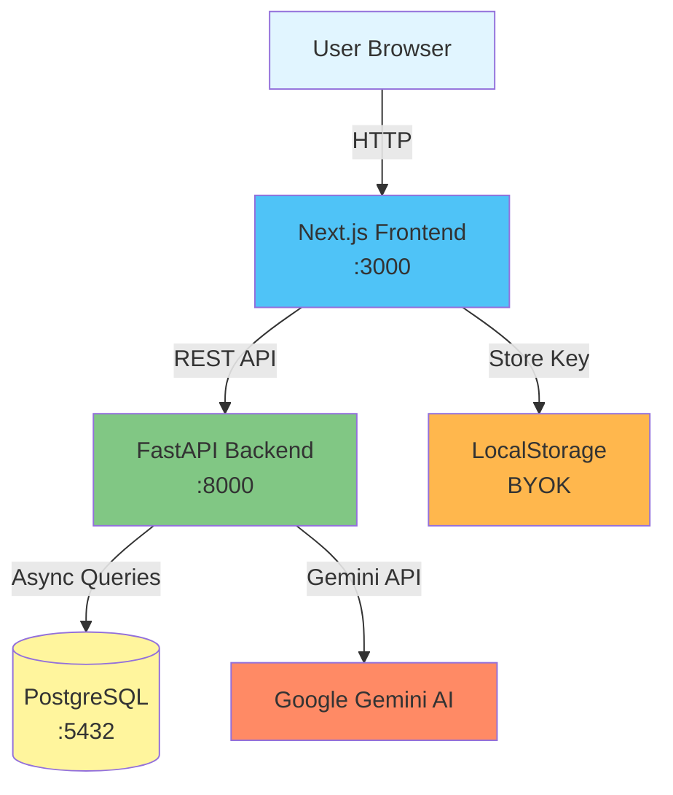
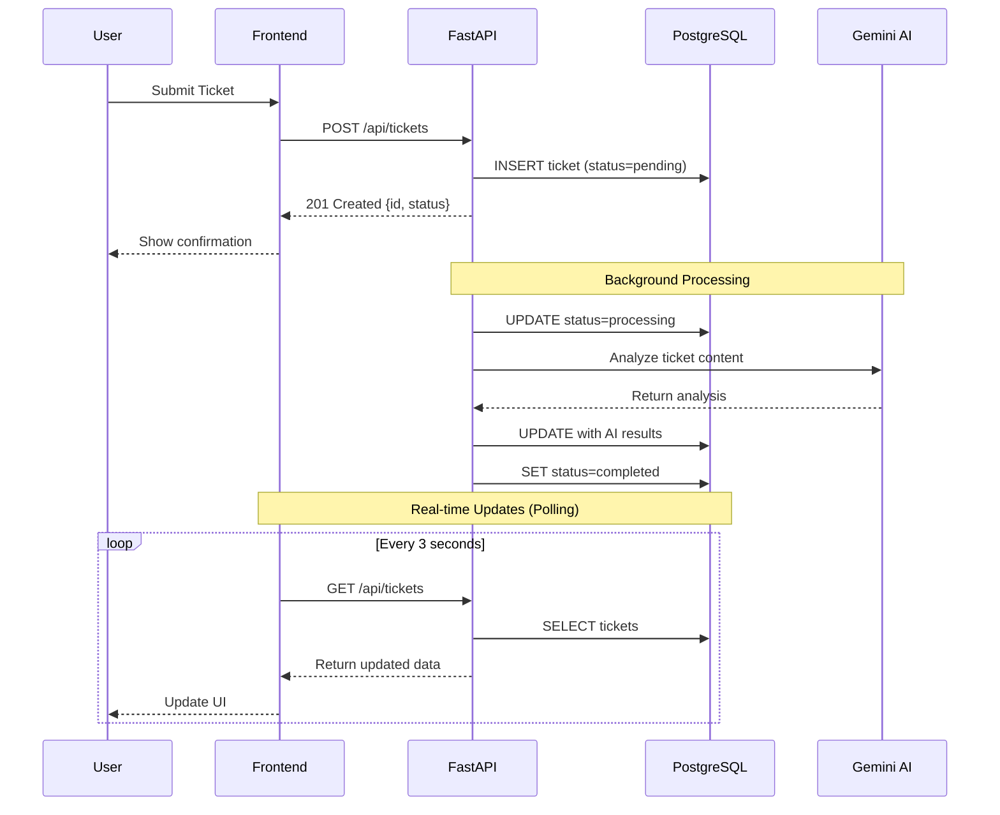

# AI Support Hub 🎯

> A production-ready ticket management system with AI-powered triage using FastAPI, Next.js, and Google Gemini.

[](https://fastapi.tiangolo.com/)
[](https://nextjs.org/)
[](https://www.postgresql.org/)
[](https://www.docker.com/)

## 📑 Table of Contents

- [Overview](#overview)
- [Features](#features)
- [Architecture](#architecture)
- [Technology Stack](#technology-stack)
- [Project Structure](#project-structure)
- [Getting Started](#getting-started)
- [Configuration](#configuration)
- [API Reference](#api-reference)
- [Frontend Guide](#frontend-guide)
- [Development](#development)
- [Testing](#testing)
- [Deployment](#deployment)
- [Troubleshooting](#troubleshooting)

## Overview

AI Support Hub is a modern full-stack application that demonstrates:
- **Async/Non-blocking architecture** with Fast API
- **AI-powered ticket triage** using Google Gemini
- **Real-time updates** with SWR polling
- **BYOK (Bring Your Own Key)** support for Gemini AI
- **Containerized deployment** with Docker Compose

### Live Demo

Once running locally:
- **Frontend**: http://localhost:3000
- **API Docs**: http://localhost:8000/docs (Interactive Swagger UI)
- **Health Check**: http://localhost:8000/health

## Features

### Core Features

✅ **Ticket Submission** - Users submit support tickets via web form or API  
✅ **AI Analysis** - Automatic categorization, urgency detection, sentiment analysis  
✅ **Draft Responses** - AI generates contextual support responses  
✅ **Real-time Dashboard** - Live ticket status updates  
✅ **Database Management** - Admin panel with stats, exports (CSV/JSON), bulk operations  
✅ **API Key Management** - Bring your own Gemini API key with validation  

### Technical Features

✅ **Async Processing** - Non-blocking API with background tasks  
✅ **Type Safety** - Pydantic (Python) + TypeScript (Frontend)  
✅ **Error Handling** - Retries, fallbacks, graceful degradation  
✅ **Rate Limiting** - Prevents API abuse  
✅ **WebSocket Support** - Real-time ticket updates (alternative to polling)  
✅ **Health Checks** - Monitoring for all services  
✅ **CORS** - Configured for cross-origin requests  

## Architecture

### System Diagram



### Request Flow



## Technology Stack

| Layer | Technology | Version | Purpose |
|-------|-----------|---------|---------|
| **Frontend** | Next.js | 14+ | React framework with App Router |
| | TypeScript | 5+ | Type safety |
| | Tailwind CSS | 3+ | Styling |
| | SWR | 2+ | Data fetching & caching |
| | Lucide React | - | Icons |
| **Backend** | FastAPI | 0.110+ | Async Python web framework |
| | Python | 3.11+ | Programming language |
| | Pydantic | 2+ | Data validation |
| | SQLAlchemy | 2+ | ORM for database |
| | Uvicorn | - | ASGI server |
| **Database** | PostgreSQL | 16 | Relational database |
| **AI** | Google Gemini | 1.5-flash | LLM for ticket analysis |
| **Infrastructure** | Docker | 24+ | Containerization |
| | Docker Compose | 2+ | Multi-container orchestration |

## Project Structure

```
Ticket-Management-System/
├── backend/                  # FastAPI Backend
│   ├── app/
│   │   ├── main.py          # FastAPI entry + middleware
│   │   ├── database.py      # SQLAlchemy async setup
│   │   ├── models.py        # ORM models
│   │   ├── schemas.py       # Pydantic validation schemas
│   │   ├── tasks.py         # Background task processing
│   │   ├── middleware.py    # CORS, logging, rate limiting
│   │   ├── exceptions.py    # Custom exception classes
│   │   ├── api/
│   │   │   └── v1/
│   │   │       └── endpoints/
│   │   │           └── tickets.py  # API routes
│   │   ├── core/
│   │   │   └── config.py    # Settings management
│   │   └── services/
│   │       └── ai_service.py # Gemini integration
│   ├── tests/               # Backend tests
│   │   ├── test_api.py
│   │   ├── test_rate_limit.py
│   │   └── test_websocket.py
│   ├── alembic/             # DB migrations
│   ├── Dockerfile
│   ├── .dockerignore
│   └── pyproject.toml
├── frontend/                 # Next.js Frontend
│   ├── app/
│   │   ├── page.tsx         # Landing page
│   │   ├── layout.tsx       # Root layout
│   │   ├── globals.css      # Global styles
│   │   ├── dashboard/
│   │   │   └── page.tsx     # Dashboard UI
│   │   ├── submit/
│   │   │   └── page.tsx     # Ticket form
│   │   └── settings/
│   │       └── page.tsx     # API key config
│   ├── components/
│   │   ├── landing/         # Landing page components
│   │   │   ├── HeroSection.tsx
│   │   │   ├── FeaturesSection.tsx
│   │   │   ├── HowItWorksSection.tsx
│   │   │   ├── CTASection.tsx
│   │   │   └── NavBar.tsx
│   │   ├── ui/              # shadcn/ui components
│   │   │   ├── button.tsx
│   │   │   ├── card.tsx
│   │   │   ├── badge.tsx
│   │   │   └── ...
│   │   └── toast-provider.tsx
│   ├── lib/
│   │   ├── api.ts           # API client with retry logic
│   │   ├── types.ts         # TypeScript interfaces
│   │   └── utils.ts         # Utility functions
│   ├── hooks/
│   │   └── use-toast.ts
│   ├── Dockerfile
│   ├── .dockerignore
│   └── package.json
├── docker-compose.yml        # Service orchestration
├── .env.example              # Environment template
├── .gitignore
└── README.md
```

## Getting Started

### Prerequisites

- **Docker Desktop** (or Rancher Desktop/Podman Desktop)
  - Download: https://www.docker.com/products/docker-desktop
- **Git**
- **Google Gemini API Key** (free tier available)
  - Get yours at: https://makersuite.google.com/app/apikey

### Quick Start

1. **Clone the repository**
   ```bash
   git clone <repo-url>
   cd Ticket-Management-System
   ```

2. **Create environment file**
   ```bash
   cp .env.example .env
   # The defaults work for local development, no changes needed!
   ```

3. **Start all services**
   ```bash
   docker-compose up --build
   ```

   This will start:
   - PostgreSQL database on port 5432
   - FastAPI backend on port 8000
   - Next.js frontend on port 3000

4. **Access the application**
   - Frontend: http://localhost:3000
   - API Documentation: http://localhost:8000/docs
   - API Health: http://localhost:8000/health

5. **Configure your API key**
   - Navigate to Settings: http://localhost:3000/settings
   - Enter your Gemini API key
   - Click "Test Key" to validate
   - Click "Save Key" (stored securely in browser localStorage)

### First Ticket Submission

1. Go to http://localhost:3000
2. Click "Submit Ticket" or scroll to CTA section
3. Enter a support request like: *"My account is locked and I can't log in"*
4. Submit and watch real-time processing!
   - Status changes: `pending` → `processing` → `completed`
   - AI assigns category, urgency, and generates a response

---

## Configuration

### Environment Variables

**Root `.env`** (used by docker-compose):

```bash
# Database Configuration
POSTGRES_USER=postgres
POSTGRES_PASSWORD=postgres
POSTGRES_DB=tickets

# Backend Configuration
DATABASE_URL=postgresql+asyncpg://postgres:postgres@db:5432/tickets
SECRET_KEY=your-secret-key-change-in-production

# Optional: Server-side API key (BYOK takes priority)
OPENAI_API_KEY=  # Not used currently
GEMINI_API_KEY=  # Optional fallback

# Frontend Configuration
NEXT_PUBLIC_API_URL=http://localhost:8000/api
```

### BYOK (Bring Your Own Key)

The system supports **user-provided Gemini API keys** for enhanced security:

**How it works:**
1. **Frontend Storage**: User's key stored in `localStorage`
2. **API Header**: Sent as `X-Gemini-Key` header with each AI request
3. **Backend Priority**: User key > Server environment key
4. **Validation**: `/test-api-key` endpoint validates keys before saving

**Benefits:**
- ✅ No server-side API key exposure
- ✅ Users control their own quota/billing
- ✅ Enterprise-friendly (users can bring corporate keys)
- ✅ Zero-trust architecture

---

## API Reference

### Base URL
```
http://localhost:8000/api
```

### Endpoints

#### **POST /api/tickets**
Submit a new support ticket.

**Request:**
```json
{
  "request_content": "My subscription billing is incorrect"
}
```

**Response (201 Created):**
```json
{
  "id": "uuid",
  "request_content": "...",
  "status": "pending",
  "category": null,
  "urgency": null,
  "sentiment_score": null,
  "draft_response": null,
  "created_at": "2026-02-06T12:00:00Z"
}
```

#### **GET /api/tickets**
List all tickets with pagination.

**Query Parameters:**
- `status_filter`: Filter by status
- `category_filter`: Filter by category
- `limit`: Results per page (max: 1000)
- `offset`: Pagination offset

**Response (200 OK):**
```json
{
  "tickets": [...],
  "total": 42,
  "limit": 50,
  "offset": 0
}
```

#### **GET /api/tickets/{id}**
Get a specific ticket.

#### **PATCH /api/tickets/{id}**
Update a ticket.

#### **DELETE /api/tickets/{id}**
Delete a specific ticket.

#### **DELETE /api/tickets/all**
Delete all tickets (admin function).

#### **GET /api/db/stats**
Get database statistics.

**Response:**
```json
{
  "total_tickets": 42,
  "pending": 5,
  "processing": 2,
  "completed": 35,
  "database_size_mb": 0.08,
  "active_connections": 3
}
```

#### **POST /api/test-api-key**
Validate a Gemini API key.

**Headers:**
```
X-Gemini-Key: your-api-key-here
```

---

## Frontend Guide

### Pages

| Route | Purpose |
|-------|---------|
| `/` | Landing page |
| `/dashboard` | Admin dashboard |
| `/submit` | Ticket form |
| `/settings` | API key management |

### API Client

Located in `lib/api.ts`:
- Automatic retries (3 attempts)
- Error handling with `APIError`
- BYOK support (`X-Gemini-Key` header)
- TypeScript types

---

## Development

### Running Locally (Without Docker)

**Backend:**
```bash
cd backend
python3.11 -m venv venv
source venv/bin/activate
pip install -e .
uvicorn app.main:app --reload --port 8000
```

**Frontend:**
```bash
cd frontend
npm install
npm run dev
```

### Viewing Logs

```bash
# All services
docker-compose logs -f

# Specific service
docker-compose logs -f backend
```

### Database Access

```bash
# Connect to PostgreSQL
docker-compose exec db psql -U postgres -d tickets

# Query tickets
SELECT id, status, category FROM tickets;
```

---

## Testing

### Backend Tests

```bash
cd backend
pytest tests/ -v
```

### Manual E2E Test

```bash
# Submit ticket
curl -X POST http://localhost:8000/api/tickets \
  -H "Content-Type: application/json" \
  -d '{"request_content": "Test ticket"}'

# Check status
curl http://localhost:8000/api/tickets
```

---

## Deployment

### Production Checklist

- [ ] Set strong `POSTGRES_PASSWORD`
- [ ] Configure HTTPS/TLS
- [ ] Enable rate limiting
- [ ] Set up monitoring
- [ ] Configure automated backups
- [ ] Add authentication (JWT)
- [ ] Set `DEBUG=false`

---

## Troubleshooting

### Common Issues

#### Backend won't start

**Error**: `ModuleNotFoundError: No module named 'google.generativeai'`

**Solution**:
```bash
docker-compose exec backend pip install google-generativeai
docker-compose restart backend
```

#### Database connection failed

**Solution**:
```bash
docker-compose ps  # Check if DB is running
docker-compose restart db
```

#### CORS errors

**Solution**: Check `backend/app/middleware.py`:
```python
allow_origins=["http://localhost:3000"]
```

#### API Key not working

**Solutions**:
1. Verify key at https://makersuite.google.com/app/apikey
2. Check browser console for `X-Gemini-Key` header
3. Clear localStorage and re-save
4. Check backend logs: `docker-compose logs backend`

---

## Contributing

1. Fork the repository
2. Create feature branch: `git checkout -b feature/amazing-feature`
3. Commit: `git commit -m 'feat: add amazing feature'`
4. Push: `git push origin feature/amazing-feature`
5. Open Pull Request

### Code Standards

**Backend**: PEP 8, type hints, docstrings  
**Frontend**: TypeScript strict mode, Prettier formatting  
**Commits**: Conventional commits (feat:, fix:, docs:)

---

## License

MIT License - See LICENSE file for details

---

## Acknowledgments

- **FastAPI** - Modern Python web framework
- **Next.js** - The React framework
- **Google Gemini** - AI language model
- **shadcn/ui** - UI components
- **PostgreSQL** - Database

---

**Built with ❤️ for modern full-stack development**

*Demonstrating production-ready architecture, AI integration, and developer best practices.*
